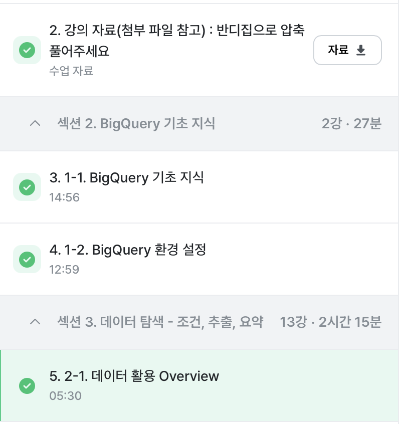
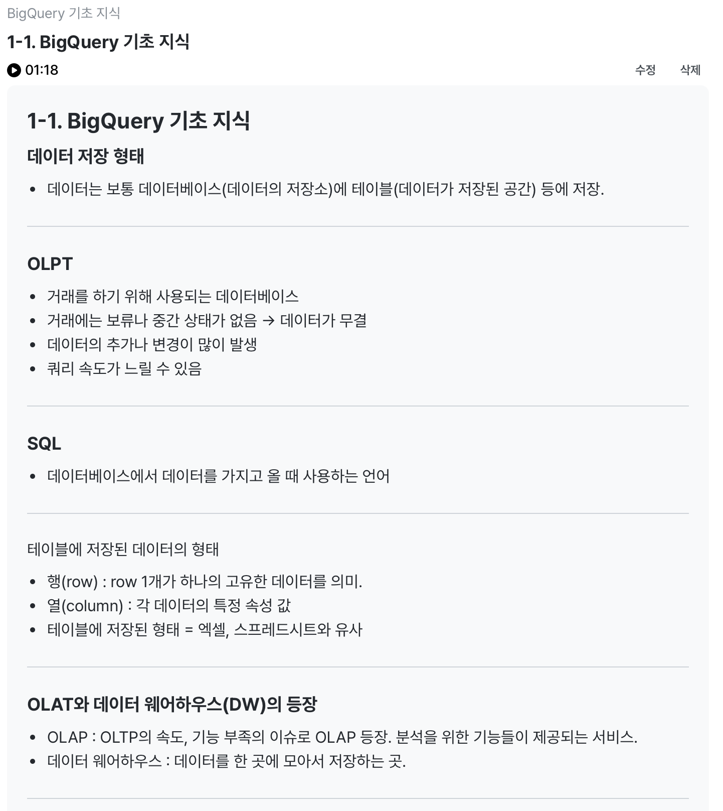
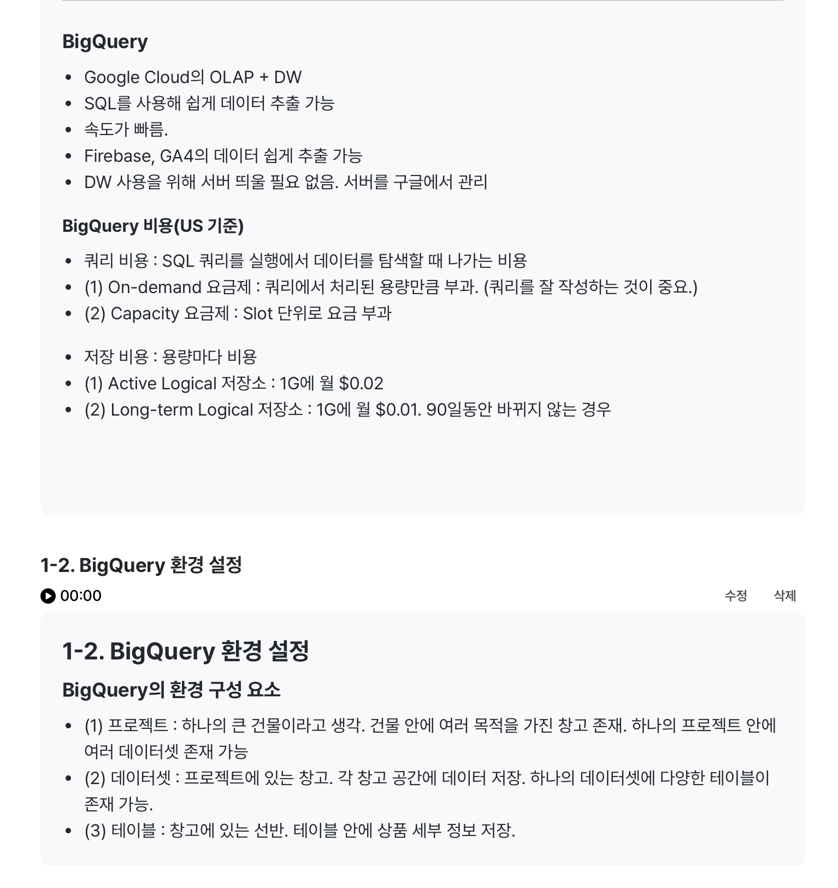
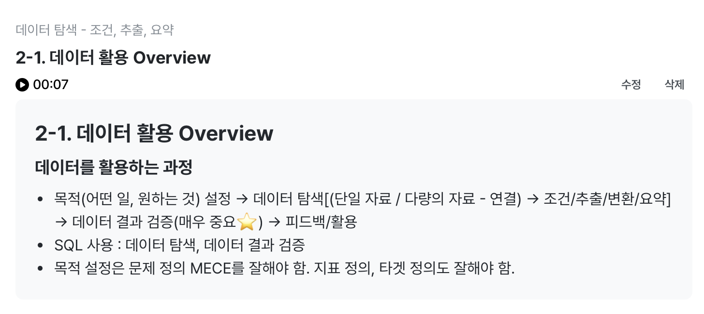

# 📘 SQL_BASIC 1주차 정규 과제

SQL_BASIC 정규 과제는 매주 정해진 분량의 `초보자를 위한 BigQuery(SQL) 입문` 강의를 듣고, 핵심 개념을 정리한 뒤 간단한 SQL 문제를 직접 풀어보는 방식으로 진행합니다.

이번 주는 BigQuery 환경과 SQL의 기본 구조를 익히고, 데이터가 어떤 형태로 저장되고 활용되는지 생각해봅니다.

완성된 과제는 Github에 업로드하고, 링크를 스프레드시트 'SQL' 시트에 입력해 제출해주세요.

**👀 수행 인증란은 필수입니다.**

---

## 📚 SQL_BASIC_1st_TIL

### 섹션 2. BigQuery 기초 지식

### 1-1. BigQuery 기초 지식

### 1-2. BigQuery 환경 설정

### 섹션 3. 데이터 탐색 - 조건, 추출, 요약

### 2-1. 데이터 활용 Overview

---

## ✨ 선택 강의

- 1. 강의 소개 & 상황별 추천 수강 방법 미리보기: 강의 전체 구성과 수강 방향을 확인하고 싶을 때 선택 수강

---

## 🏁 전체 강의 수강 계획

| 주차 | 필수 강의 범위 | 선택 강의 | 완료 여부 |
| --- | --- | --- | --- |
| 1주차 | 1-1 ~ 2-1 | 1 | ✅ |
| 2주차 | 2-2 ~ 2-3 | 2-4 | 🍽️ |
| 3주차 | 2-5, 2-7 ~ 2-8 | 2-6 | 🍽️ |
| 4주차 | 3-2 ~ 4-3 | 3-4 | 🍽️ |
| 5주차 | 4-4 ~ 4-6 | 4-5, 4-7 | 🍽️ |
| 6주차 | 5-2 ~ 5-5 | 5-6 | 🍽️ |
| 7주차 | 필수 강의 없음 | 6-2, 6-3, 6-4, 6-5 | 🍽️ |

---

<br>

<!-- 여기까진 그대로 둬 주세요-->

---

# 1️⃣ 개념 정리

아래 키워드 중 중요하다고 생각한 개념을 2개 이상 골라 짧게 정리해주세요. 3개보다 더 많이 정리하고 싶다면 자유롭게 항목을 추가해도 좋습니다.

이번 주 키워드:
- SQL
- BigQuery
- Database
- Table
- Row
- Column
- 데이터 활용 과정

## 01.

```
개념 이름: Database
개념 설명: 데이터의 저장소
활용 상황: 데이터는 보통 데이터베이스의 테이블 등에 저장됨. 
```

## 02.

```
개념 이름: Table
개념 설명: 데이터가 저장된 공간. 데이터셋을 프로젝트에 있는 창고라고 생각한다면 테이블은 창고에 있는 선반이라고 생각할 수 있음. 
활용 상황: 테이블 안에 상품 세부 정보를 저장할 수 있음. 
```

## (선택) 03.

```
개념 이름: BigQuery
개념 설명: Google Cloud의 OLAP + DW
활용 상황: 회사에서 앱이나 웹에서 Firebase, GA4를 활용할 경우. 운영을 적은 비용(인력 등)으로 진행하는 경우. 
```

---

# 2️⃣ 수행 인증란

아래 중 하나 이상을 첨부해주세요.

- 강의 수강 화면 캡처




- 이번 주 학습 내용을 정리한 노트 캡처



---

# 3️⃣ 확인 문제

## 🧩 문제 1

포켓몬 게임이나 이커머스 산업과 같이 다양한 산업에서는 각기 다른 데이터가 존재합니다. 다음 중 하나의 산업을 선택하고, 해당 산업에서 수집하고 활용될 수 있는 데이터 항목, 즉 컬럼 5가지를 자유롭게 상상하여 나열해주세요.

예시 산업:
- 온라인 음식 배달
- 스마트 헬스 케어
- 중고 거래 앱
- 교육 플랫폼

풀이 과정:

```
- 선택한 산업: 교육 플랫폼
- 떠올린 컬럼 5가지: 이용자 id, 나이, 과목 id, 콘텐츠 id, 하루 평균 학습시간
- 해당 컬럼이 필요하다고 생각한 이유: 이용자 id - 이용자의 여러 학습 기록을 하나로 연결하고 학습 이력을 추적하기 위해 필요하기 때문./ 나이 - 이용자의 연령에 따라 콘텐츠의 종류, 수준/ 학습 방식과 시간 등이 달라질 수 있기 때문./ 과목 id, 콘텐츠 id - 어떤 과목이나 콘텐츠에서 학습이 이루어졌는지 파악이 필요하기 때문. / 하루 평균 학습시간 - 이용자의 학습 상태를 파악할 수 있을 뿐만 아니라 이탈 가능성 예측이 가능하기 때문.  
```

## 🧩 문제 2

이번 강의를 통해 SQL이 왜 필요하다고 느끼는지, SQL을 통해 본인이 어떤 것을 해내고 싶은지를 자유롭게 작성해주세요.

풀이 과정:

```
- SQL이 필요하다고 느낀 이유: 데이터를 분석하고 활용하는 과정에서 데이터 탐색과 데이터 결과 검증은 핵심적인 과정들이라고 배웠는데, 이러한 핵심적인 과정들을 수행하는 데에 SQL이 사용되기 때문에 SQL이 필요하다고 느꼈다. 
- SQL로 해보고 싶은 일: 플랫폼 서비스와 관련된 데이터를 분석하여 고객의 서비스 이용 패턴을 파악하고 고객에게 적합한 서비스를 제공할 수 있도록 서비스 개선을 하는 데에 SQL를 사용해 보고 싶다. 
- 앞으로 SQL을 공부할 때 기대되는 점:SQL을 활용하여 실제 데이터를 직접 다루어보면서 단순한 쿼리부터 복잡한 쿼리를 배워보고 싶다. 
```

---

# 4️⃣ 이번 주 회고

```
1. SQL을 처음 써보면서 가장 낯설었던 점: battle 테이블을 생성할 때 스키마를 직접 정의하고 파티션을 나누기와 고급 옵션을 설정하는 과정이 가장 낯설었다. 지금까지 기존 테이블을 그대로 불러와 데이터 분석에 활용해보는 것만 해보고 파티션 나누기와 같은 과정은 수행해보지 않아서 더욱 낯설게 느껴졌다. 
2. 다음 주에 더 익숙해지고 싶은 부분: 다음 주 강의를 듣고 과제를 수행하면서 쿼리를 작성하고 이해하는 것에 더욱 익숙해지고 싶다. 
3. 과제 진행 중 막혔던 부분이 있다면: 문제 1번을 풀 때, 컬럼을 떠올리는 것은 어렵지 않게 할 수 있었지만 해당 컬럼이 필요한 이유에 대해 설명하는 것이 조금 어렵게 느껴졌다. 아직 데이터 항목에 대한 지식이 부족하여 필요한 컬럼에 대한 기준이 모호하게 있기 때문에 이유를 설명하는 것이 어렵게 느껴졌다고 생각한다. 
```

수고하셨습니다!
