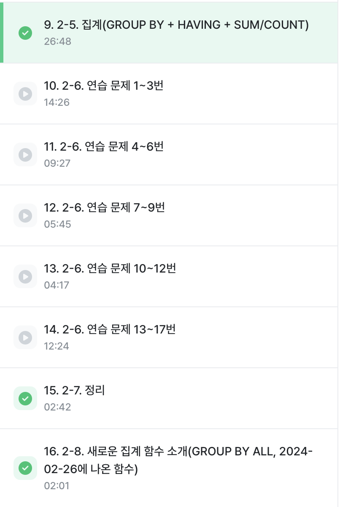
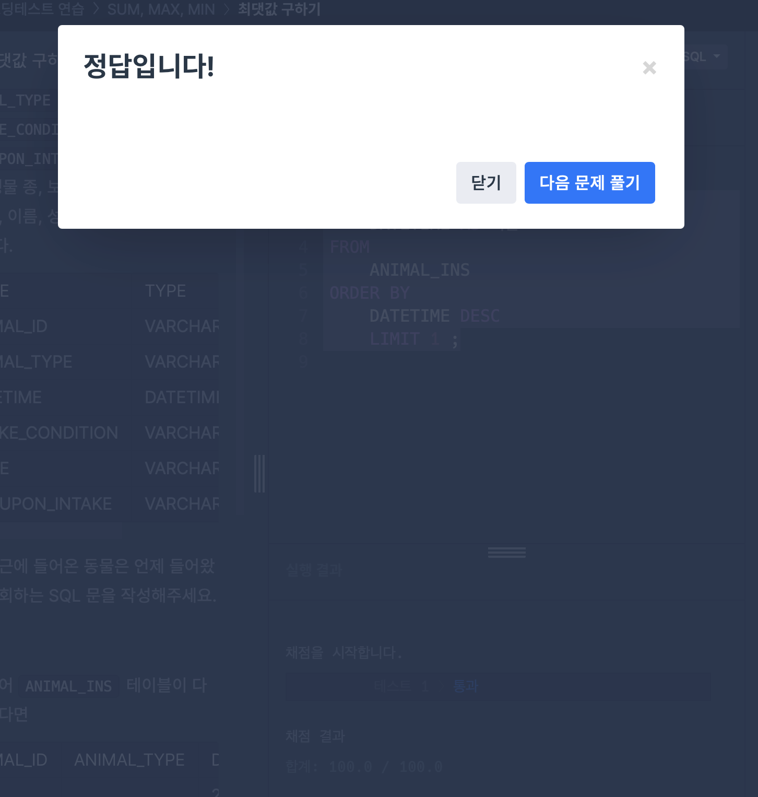
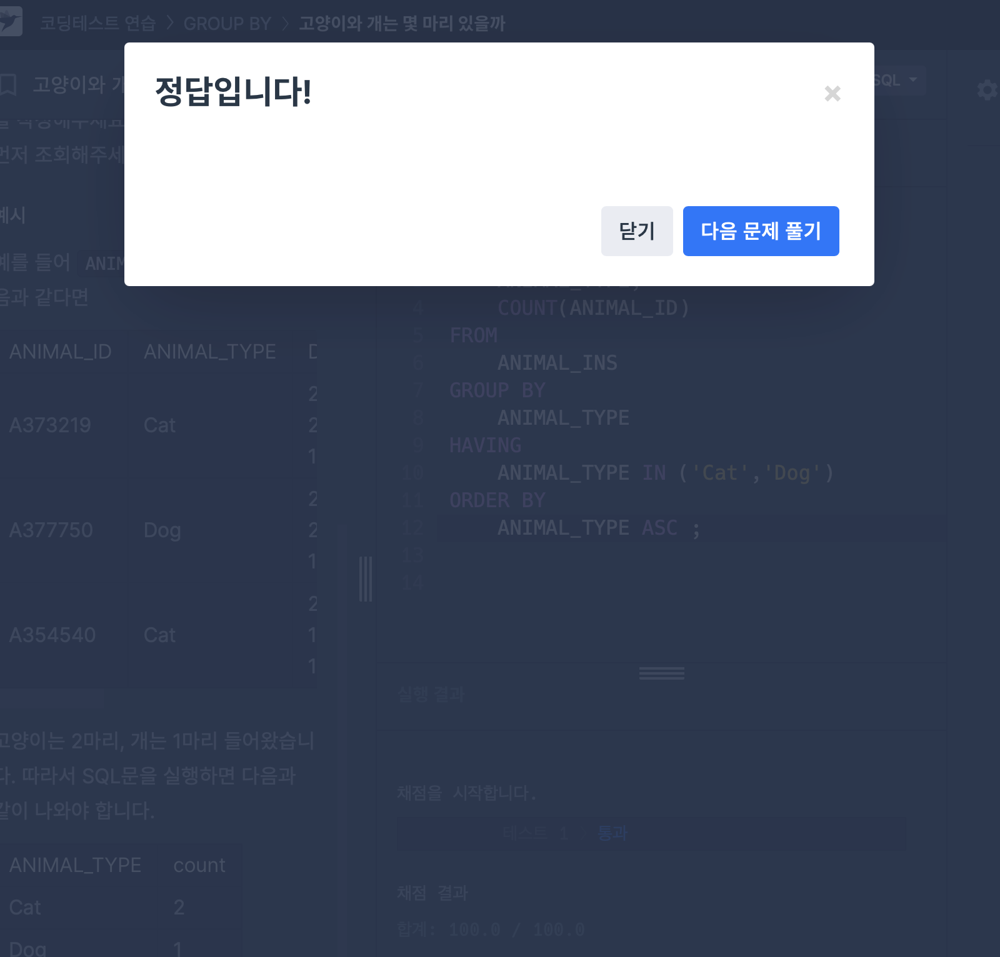
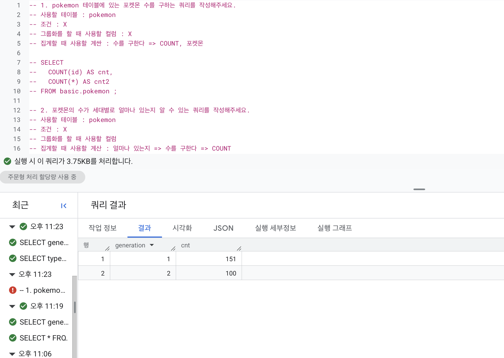
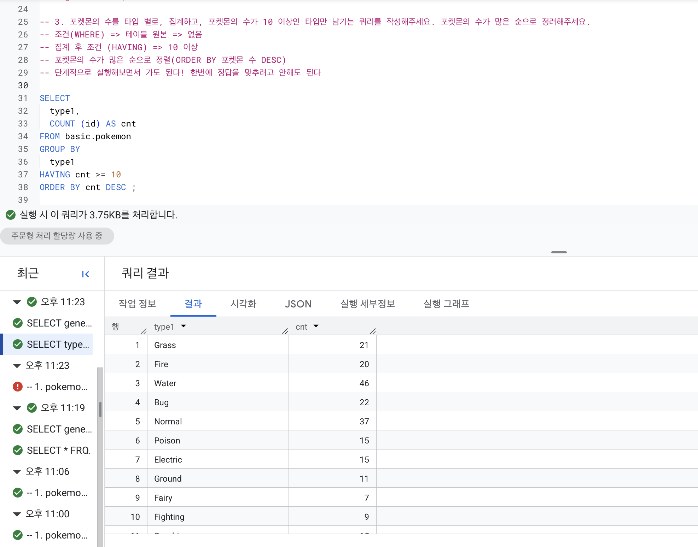
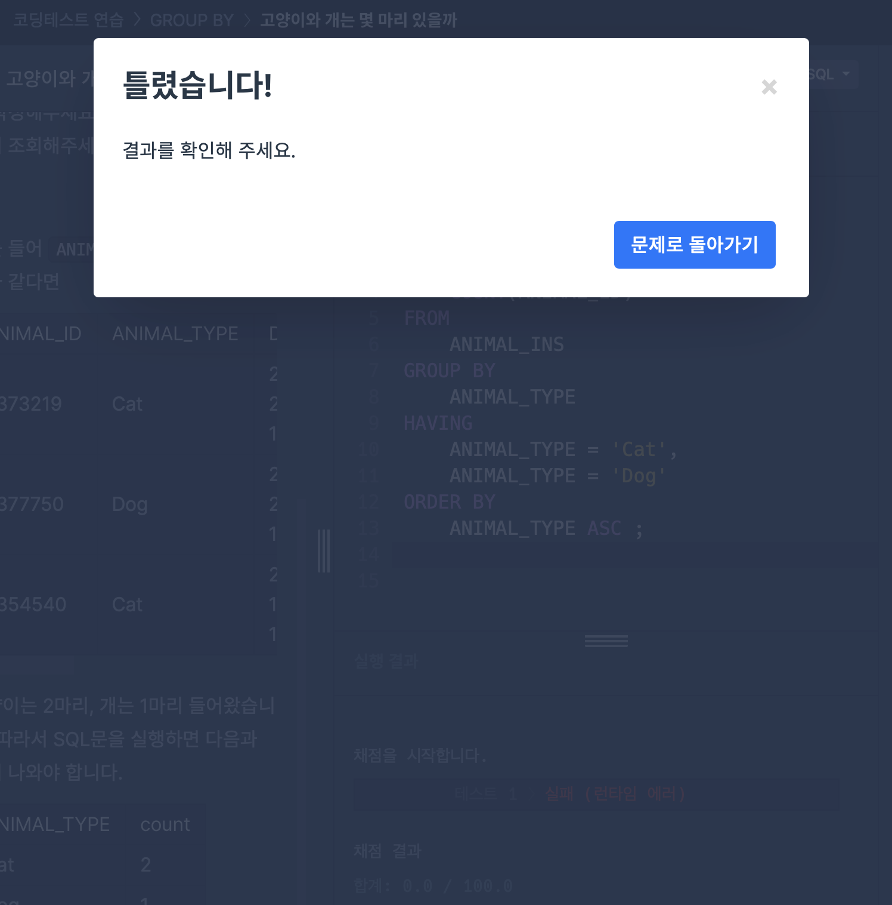

# 📘 SQL_BASIC 3주차 정규 과제

SQL_BASIC 정규 과제는 매주 정해진 분량의 `초보자를 위한 BigQuery(SQL) 입문` 강의를 듣고, 핵심 개념을 정리한 뒤 간단한 SQL 문제를 직접 풀어보는 방식으로 진행합니다.

이번 주는 집계 함수와 `GROUP BY`, `HAVING`을 학습합니다.

완성된 과제는 Github에 업로드하고, 링크를 스프레드시트 'SQL' 시트에 입력해 제출해주세요.

**👀 수행 인증란은 필수입니다.**

---

## 📚 SQL_BASIC_3rd_TIL

### 섹션 3. 데이터 탐색 - 조건, 추출, 요약

### 2-5. 집계(GROUP BY + HAVING + SUM/COUNT)

### 2-7. 정리

### 2-8. 새로운 집계 함수 소개(GROUP BY ALL, 2024-02-26에 나온 함수)

---

## ✨ 선택 강의

- 2-6. 연습 문제: 집계와 조건 조회를 더 연습하고 싶을 때 선택 수강

---

## 🏁 전체 강의 수강 계획

| 주차 | 필수 강의 범위 | 선택 강의 | 완료 여부 |
| --- | --- | --- | --- |
| 1주차 | 1-1 ~ 2-1 | 1 | ✅ |
| 2주차 | 2-2 ~ 2-3 | 2-4 | ✅ |
| 3주차 | 2-5, 2-7 ~ 2-8 | 2-6 | ✅ |
| 4주차 | 3-2 ~ 4-3 | 3-4 | 🍽️ |
| 5주차 | 4-4 ~ 4-6 | 4-5, 4-7 | 🍽️ |
| 6주차 | 5-2 ~ 5-5 | 5-6 | 🍽️ |
| 7주차 | 필수 강의 없음 | 6-2, 6-3, 6-4, 6-5 | 🍽️ |

---

<br>

<!-- 여기까진 그대로 둬 주세요-->

---

# 1️⃣ 개념 정리

아래 키워드 중 중요하다고 생각한 개념을 2개 이상 골라 짧게 정리해주세요. 3개보다 더 많이 정리하고 싶다면 자유롭게 항목을 추가해도 좋습니다.

이번 주 키워드:
- COUNT
- SUM
- AVG
- MAX
- MIN
- GROUP BY
- HAVING
- 집계 기준

## 01.

```
개념 이름: GROUP BY
개념 설명: 같은 값끼리 모아서 그룹화함. 특정 컬럼 기준으로 모으면서 다른 컬럼에서는 집계 가능. 
예시 쿼리:

SELECT
  generation,
  COUNT(id) AS cnt
FROM basic.pokemon
GROUP BY 
  generation ;
```

## 02.

```
개념 이름: HAVING
개념 설명: GROUP BY한 후 조건을 설정하고 싶은 경우 사용. 
예시 쿼리:

SELECT
  type1,
  COUNT (id) AS cnt
FROM basic.pokemon
GROUP BY 
  type1 
HAVING cnt >= 10
ORDER BY cnt DESC ;
```

## (선택) 03.

```
개념 이름: ORDER BY
개념 설명: 쿼리의 맨 마지막에 쓰이며, 결과값의 순서를 정하는 함수. 
헷갈린 점: ORDER BY 함수를 쓸 때 단순히 오름차순할 것인지, 내림차순할 것인지를 쓰는 것이 아니라 어떤 컬럼을 기준으로 오름차순 / 내림차순을 할 것인지를 작성해야 된다는 점이 헷갈렸다.  
```

---

# 2️⃣ 수행 인증란

아래 중 하나 이상을 첨부해주세요.

- 강의 수강 화면 캡처


- 문제 풀이 정답 화면 캡처




- SQL 실행 결과 화면 캡처


---

# 3️⃣ 확인 문제

프로그래머스는 로그인이 필요하므로, 로그인 후 문제 풀이를 진행해주세요.

## 🧩 문제 1

문제 링크: [최댓값 구하기](https://school.programmers.co.kr/learn/courses/30/lessons/59415)

풀이 과정:

```
- 문제 요구사항: 문제(가장 최근에 들어온 동물은 언제 들어왔는지 조회하는 SQL 문을 작성해주세요.) - 조건 : 시간 출력 / DATETIME 가장 최근 => 내림차순 / 가장 최근에 들어온 동물 => 출력값 1개 => LIMIT 1
- 사용한 SQL 절:
SELECT
    DATETIME AS 시간
FROM
    ANIMAL_INS
ORDER BY
    DATETIME DESC
    LIMIT 1 ;
- 새로 배운 점: (1)시간을 최근 시간 순서대로 정렬하려면 내림차순 해야된다는 것. / (2)'가장' 이라는 표현은 1개만 출력하고 싶다는 것이니 LIMIT 조건을 걸어 1개만 출력할 것. (3)MAX() 집계 함수를 이용하여 구할 수 있다는 것. 
```


## 🧩 문제 2

문제 링크: [가장 비싼 상품 구하기](https://school.programmers.co.kr/learn/courses/30/lessons/131697)

풀이 과정:

```
- 사용한 집계 함수: MAX()
- 집계 대상 컬럼: PRICE
- 결과를 검증한 방법: MAX(PRICE) 함수가 PRODUCT 테이블 내 PRICE 컬럼의 최댓값을 정상적으로 집계하고 별칭인 MAX_PRICE이 올바르게 적용되는지 확인.
```


## 🧩 문제 3

문제 링크: [고양이와 개는 몇 마리 있을까](https://school.programmers.co.kr/learn/courses/30/lessons/59040)

풀이 과정:

```
- 그룹화 기준: ANIMAL_TYPE
- WHERE와 HAVING 중 사용한 절: HAVING
- 처음 틀렸다면 틀린 이유: HAVING 절을 어떻게 작성해야 하는지 몰라서 ANIMAL = 'Cat', 'Dog'라고 작성하였는데 틀렸다는 결과가 나왔다. 
- 새로 배운 SQL 패턴: (1)여려 개의 조건값을 작성할 때는 IN ('컬럼값', '컬럼값') 절 사용 (2)'GROUP BY'의 그룹화 결과를 조건을 필터링할 때는 'HAVING' 절 사용. (3)특정 문자열 순서로 정렬하는 경우  ORDER BY ANIMAL_TYPE ASC(알파벳 오름차순 정렬)이나 FILED(컬럼, 컬럼값1, 컬럼값2)와 같이 작성 가능.  
```




---

# 4️⃣ 이번 주 회고

```
1. 문제를 SQL로 옮길 때 가장 어려웠던 부분: 문제에서 요구하는 조건을 추출하고 조건에 맞는 함수와 해당 함수가 요구하는 쿼리문(예; ORDER BY 같은 경우 (기준 컬럼) ASC/DESC // HAVING 같은 경우 IN ('컬럼값1', '컬럼값2'))을 작성해야 한다는 점이 가장 어렵게 느껴졌다. 
2. WHERE와 HAVING의 차이를 어떻게 이해했는지: WHERE - Raw Data인 테이블 데이터에서 조건 설정 / HAVING - GROUP BY한 후 조건을 설정하고 싶은 경우 사용. 
3. 다음 주에 더 연습하고 싶은 문제 유형: 강의에서 서브 쿼리에 대한 부분을 잠깐 언급해주셨는데 서브 쿼리를 작성하면 그만큼 요구하는 조건이 복잡하고 쿼리가 복잡해진다는 의미이기에 서브쿼리 문제를 풀면 쿼리를 작성하는 역량을 더 기를 수 있다고 생각해서 서브 쿼리 문제에 대해 풀어보고 싶다는 생각이 들었다. 
```

수고하셨습니다!
