# 📘 SQL_BASIC 4주차 정규 과제

SQL_BASIC 정규 과제는 매주 정해진 분량의 `초보자를 위한 BigQuery(SQL) 입문` 강의를 듣고, 핵심 개념을 정리한 뒤 간단한 SQL 문제를 직접 풀어보는 방식으로 진행합니다.

이번 주는 SQL 쿼리를 작성하는 흐름, 쿼리 작성 템플릿, 데이터 타입 변환, 문자열 함수를 학습합니다.

완성된 과제는 Github에 업로드하고, 링크를 스프레드시트 'SQL' 시트에 입력해 제출해주세요.

**👀 수행 인증란은 필수입니다.**

---

## 📚 SQL_BASIC_4th_TIL

### 섹션 4. SQL 쿼리 잘 작성하기, 쿼리 작성 템플릿 및 오류를 잘 디버깅하기

### 3-2. SQL 쿼리를 작성하는 흐름

### 3-3. 쿼리 작성 템플릿과 생산성 도구

### 섹션 5. 데이터 탐색 - 변환

### 4-1. INTRO

### 4-2. 데이터 타입과 데이터 변환(CAST, SAFE_CAST)

### 4-3. 문자열 함수(CONCAT, SPLIT, REPLACE, TRIM, UPPER)

---

## ✨ 선택 강의

- 3-4. 오류를 디버깅하는 방법: 오류 메시지 해석과 디버깅 흐름을 더 익히고 싶을 때 선택 수강

---

## 🏁 전체 강의 수강 계획

| 주차 | 필수 강의 범위 | 선택 강의 | 완료 여부 |
| --- | --- | --- | --- |
| 1주차 | 1-1 ~ 2-1 | 1 | ✅ |
| 2주차 | 2-2 ~ 2-3 | 2-4 | ✅ |
| 3주차 | 2-5, 2-7 ~ 2-8 | 2-6 | ✅ |
| 4주차 | 3-2 ~ 4-3 | 3-4 | ✅ |
| 5주차 | 4-4 ~ 4-6 | 4-5, 4-7 | 🍽️ |
| 6주차 | 5-2 ~ 5-5 | 5-6 | 🍽️ |
| 7주차 | 필수 강의 없음 | 6-2, 6-3, 6-4, 6-5 | 🍽️ |

---

<br>

<!-- 여기까진 그대로 둬 주세요-->

---

# 1️⃣ 개념 정리

아래 키워드 중 중요하다고 생각한 개념을 2개 이상 골라 짧게 정리해주세요. 3개보다 더 많이 정리하고 싶다면 자유롭게 항목을 추가해도 좋습니다.

이번 주 키워드:
- 쿼리 작성 순서
- 쿼리 작성 템플릿
- 데이터 타입
- CAST
- SAFE_CAST
- CONCAT
- REPLACE
- TRIM

## 01.

```
개념 이름: 쿼리 작성 순서 
개념 설명:
(1) 지표 고민 - 어떤 문제를 해결하기 위해 데이터가 필요한가?
(2) 지표 구체화 - 추상적이지 않고 구체적인 지표 명시 (분자, 분모 표시 -> 정의 -> 이름 : 구체적)
(3) 지표 탐색 - 유사한 문제를 해결한 케이스가 있나 확인 -존재-> 해당 쿼리 리뷰 / 없으면 구글에 검색
(4) 유사한 문제를 해결한 케이스가 없으면 쿼리 작성 - 데이터가 있는 테이블(ERD) 찾기 - 1개 / 2개 이상 - 연결 방법 고민 JOIN
(5) 데이터 정합성 확인 - 예상한 결과와 동일한지 확인
(6) 쿼리 가독성 - 나중을 위해 깔끔하게 쿼리 작성
(7) 쿼리 저장 - 쿼리는 재사용되므로 문서로 저장
예시 쿼리:
SELECT 컬럼
FROM 테이블
WHERE 조건
GROUP BY 컬럼
HAVING 그룹 조건
ORDER BY 정렬 기준
LIMIT 개수;

```

## 02.

```
개념 이름: 데이터 타입 
개념 설명: 숫자 / 문자 / 시간, 날짜 / 부울(Bool), 보이는 것과 저장된 것의 차이가 존재. 
예시 쿼리: SELECT CAST('123' AS INTEGER);
```

## (선택) 03.

```
개념 이름:
개념 설명:
헷갈린 점:
```

---

# 2️⃣ 수행 인증란

아래 중 하나 이상을 첨부해주세요.

- 강의 수강 화면 캡처
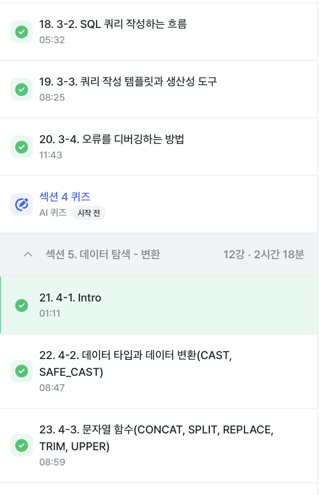

- 문제 풀이 정답 화면 캡처
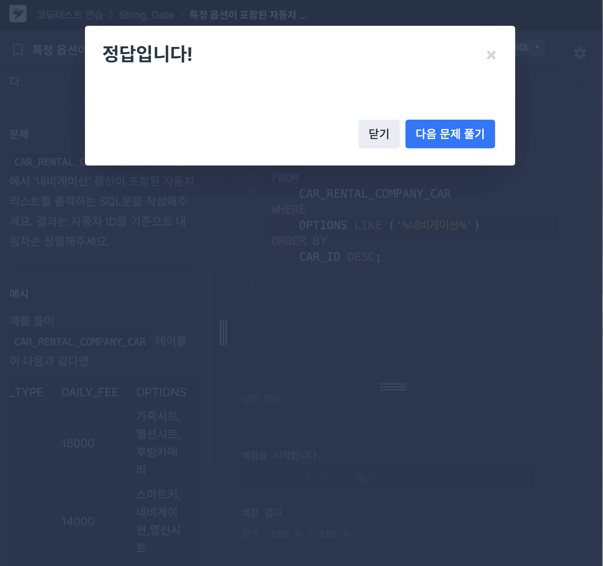
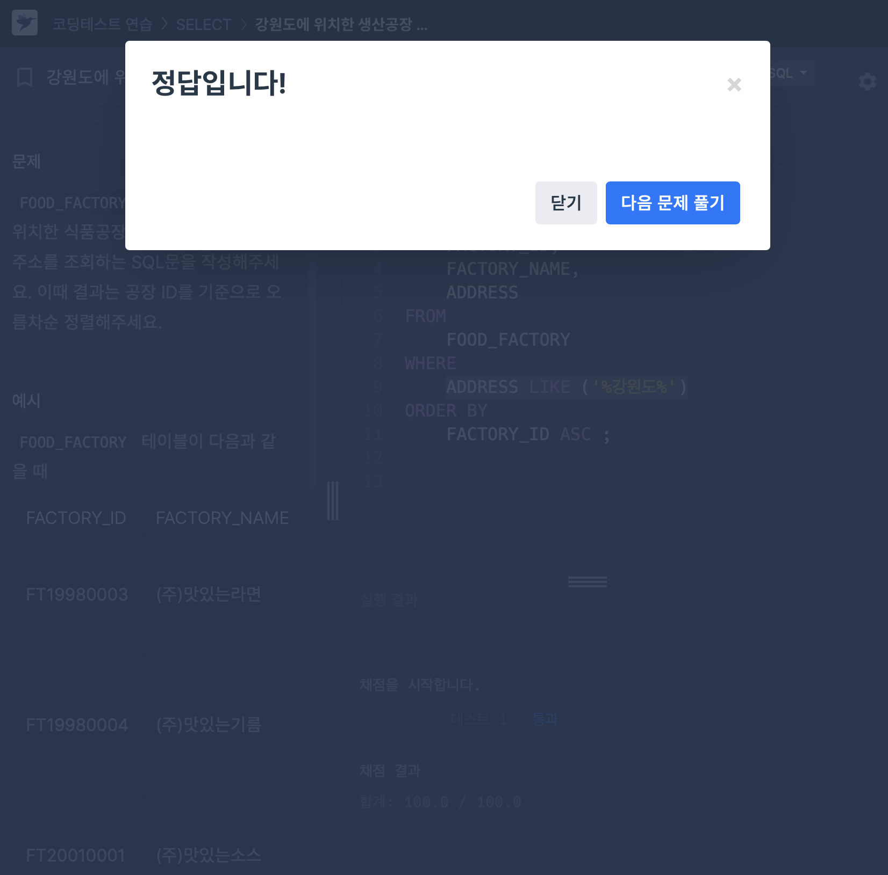
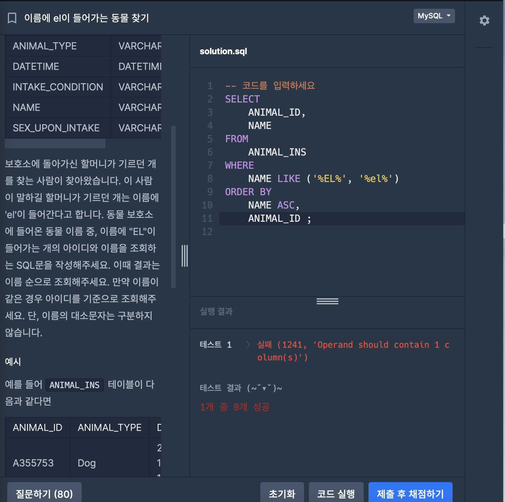
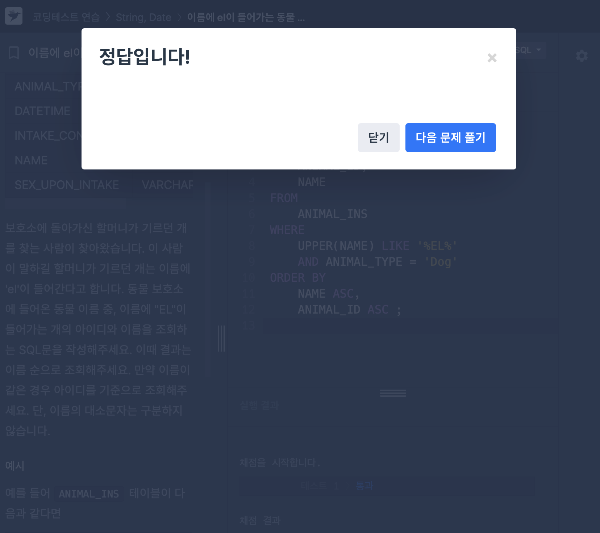
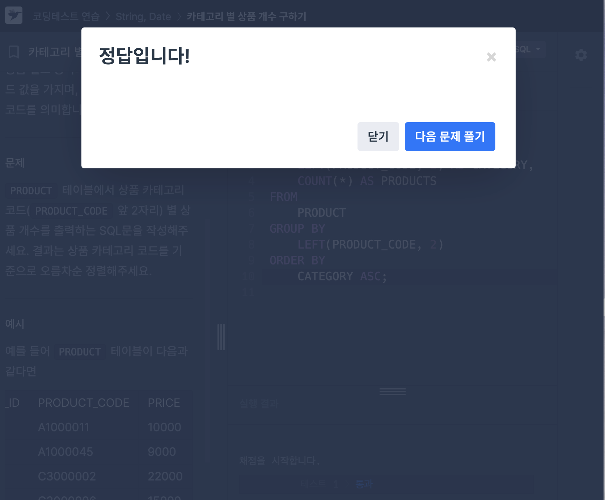

- SQL 실행 결과 화면 캡처
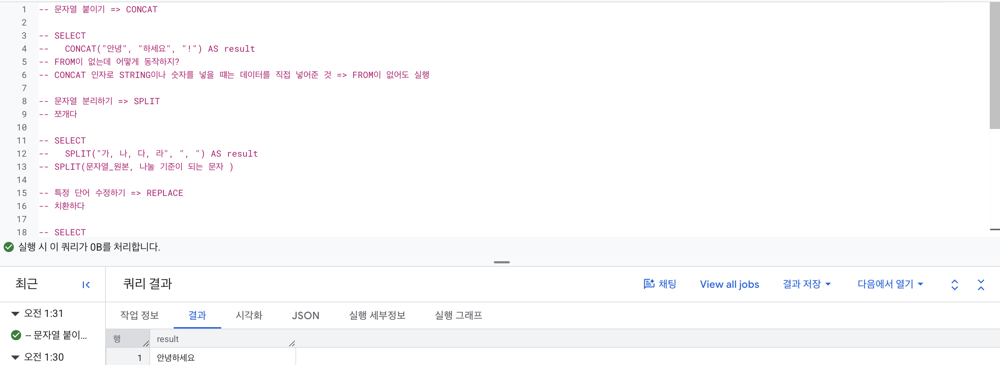
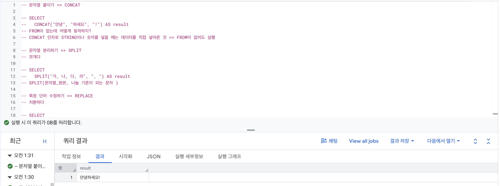
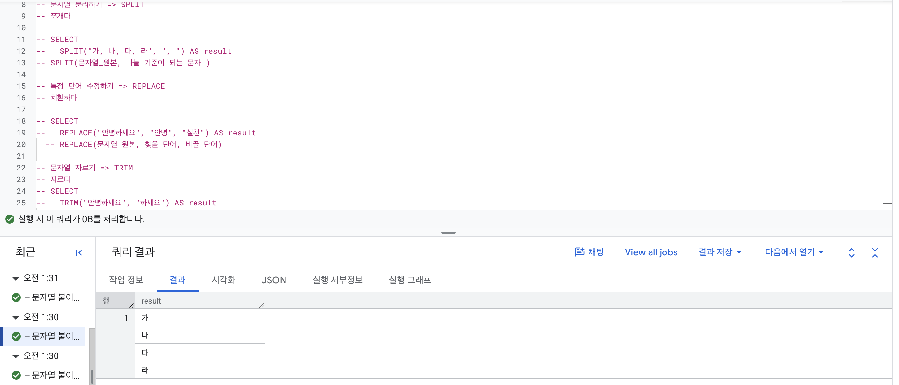
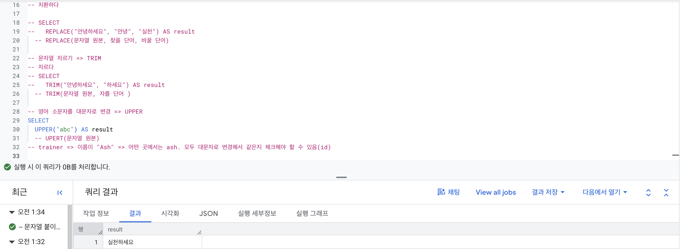
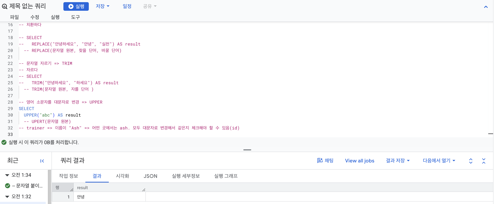
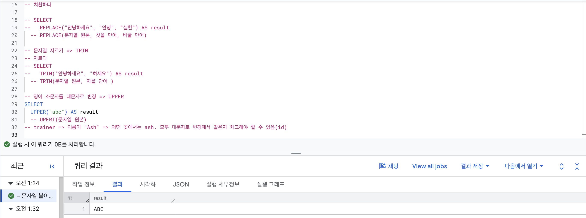
---

# 3️⃣ 확인 문제

프로그래머스는 로그인이 필요하므로, 로그인 후 문제 풀이를 진행해주세요.

## 🧩 문제 1

문제 링크: [특정 옵션이 포함된 자동차 리스트 구하기](https://school.programmers.co.kr/learn/courses/30/lessons/157343)

풀이 과정:

```
- 찾으려는 문자열 조건: 옵션에 네비게이션이 포함되어 있어야 함. 
- 사용한 문자열 조건 문법: OPTIONS IN ('네비게이션') (오답) -> OPTIONS LIKE ('%네비게이션%') (정답) 
- 정렬 기준: CAR_ID 내림차순 
```


## 🧩 문제 2

문제 링크: [강원도에 위치한 생산공장 목록 출력하기](https://school.programmers.co.kr/learn/courses/30/lessons/131112)

풀이 과정:

```
- 문제에서 요구한 조건:  ADDRESS에 강원도 존재. 공장 ID, 공장 이름, 주소 조회. 공장 ID 기준 오름차순. 
- WHERE 절로 옮긴 방식: ADDRESS LIKE ('%강원도%')
- 정렬 기준: 공장_ID 기준 오름차순 
```


## 🧩 문제 3

문제 링크: [이름에 el이 들어가는 동물 찾기](https://school.programmers.co.kr/learn/courses/30/lessons/59047)

풀이 과정:

```
- 찾으려는 문자열 패턴: EL이 이름에 존재하는지 (대소문자 상관없음) 
- 대소문자를 처리한 방식: UPPER(NAME) LIKE '%EL%' 
- 정렬 기준: NAME, NAME이 같을 경우 ANIMAL_ID ASC
```


## 🧩 문제 4

문제 링크: [카테고리 별 상품 개수 구하기](https://school.programmers.co.kr/learn/courses/30/lessons/131529)

풀이 과정:

```
- 추출한 문자열 범위: PRODUCT_CODE의 왼쪽 2자리 
- 그룹화 기준: PRODUCT_CODE의 왼쪽 2자리 
- 정렬 기준: CATEGORY 기준 오름차순 
```


---

# 4️⃣ 이번 주 회고

```
1. 쿼리 작성 흐름을 잡을 때 도움이 된 방법: 문제에서 원하는 것을 조회 / 조건 / 그룹하 / 정렬 순서로 나눠서 생각하니 쿼리의 작성 틀이 잡힌다고 느꼈다. 
2. 타입 변환이나 문자열 처리에서 조심해야 할 점: CAST, LIKE, LEFT 등의 함수 사용법을 잘 알고 있어야 한다고 생각했고 문자열의 위치와 길이를 정확히 확인해야 한다는 것을 깨달았따. 
3. 앞으로 문제 풀이 때 먼저 확인할 것: 필요한 컬럼과 조건을 먼저 파악한 다음 그룹화와 정렬 여부를 확인해야겠다. 
```

수고하셨습니다!
