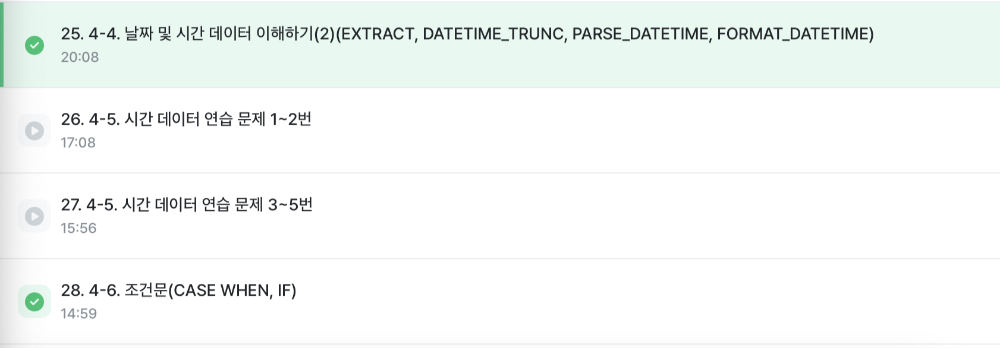
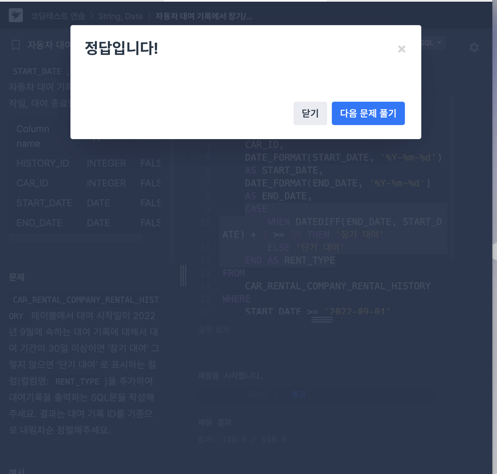
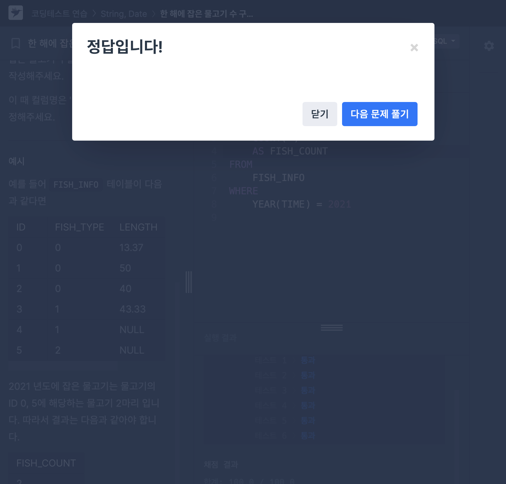
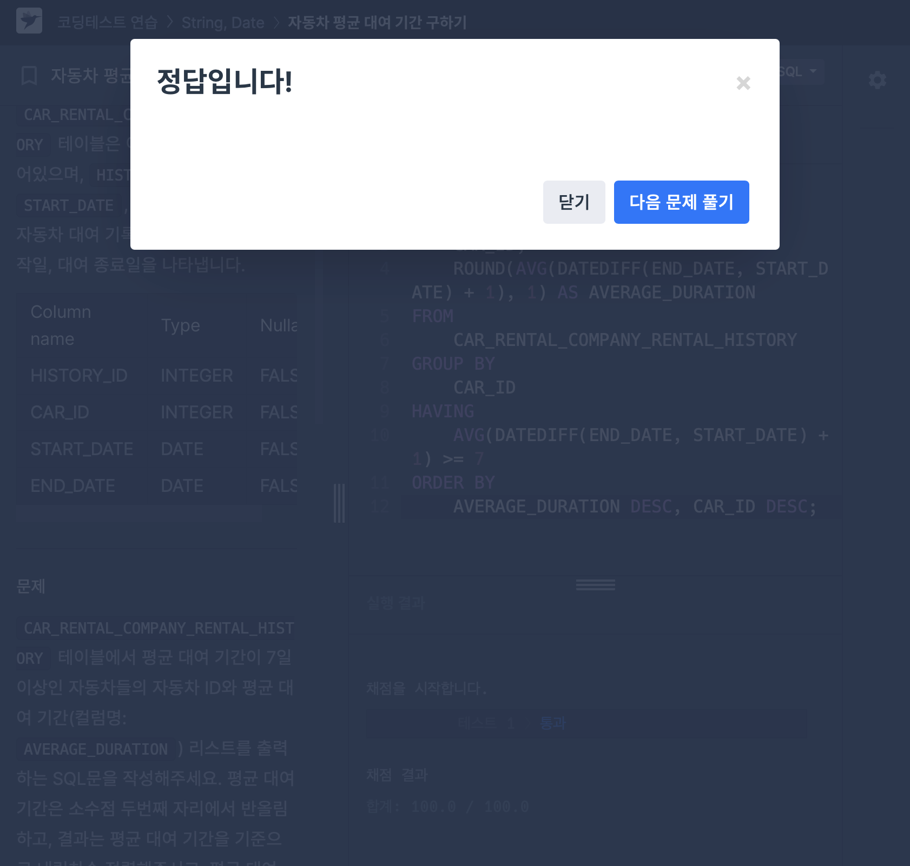
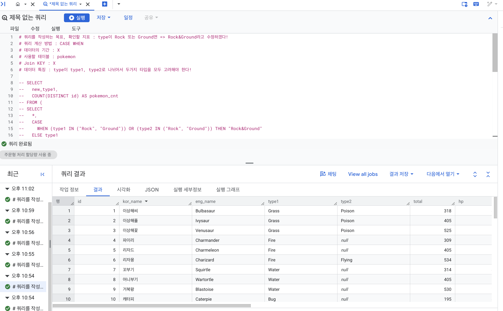
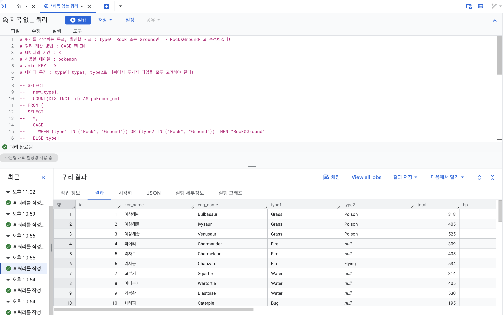
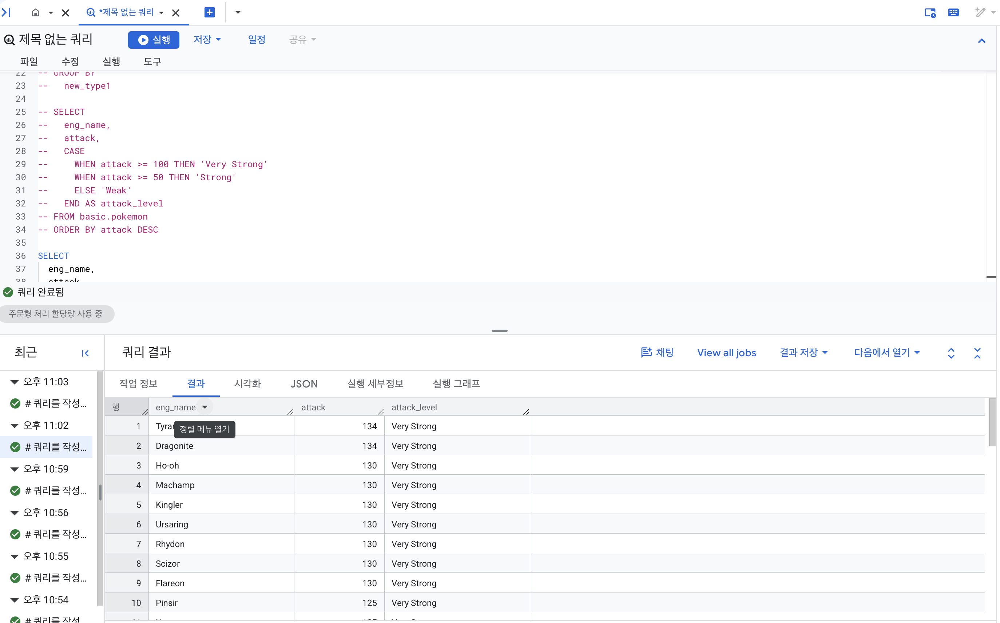
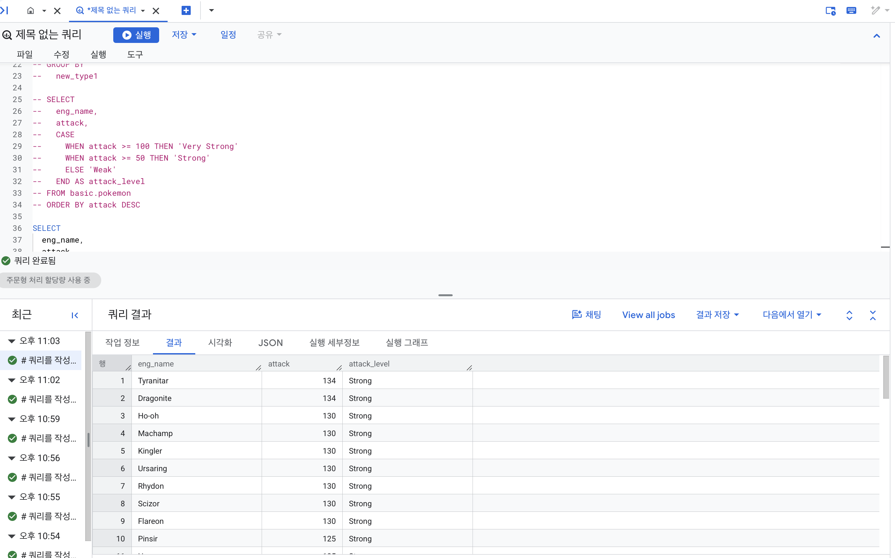

# 📘 SQL_BASIC 5주차 정규 과제

SQL_BASIC 정규 과제는 매주 정해진 분량의 `초보자를 위한 BigQuery(SQL) 입문` 강의를 듣고, 핵심 개념을 정리한 뒤 간단한 SQL 문제를 직접 풀어보는 방식으로 진행합니다.

이번 주는 날짜/시간 데이터와 조건문을 학습합니다. 특히 `CASE WHEN`은 SQL 문제 풀이와 데이터 분석에서 자주 사용되므로, 직접 분류 기준을 만들고 결과를 확인하는 연습을 해주세요.

완성된 과제는 Github에 업로드하고, 링크를 스프레드시트 'SQL' 시트에 입력해 제출해주세요.

**👀 수행 인증란은 필수입니다.**

---

## 📚 SQL_BASIC_5th_TIL

### 섹션 5. 데이터 탐색 - 변환

### 4-4. 날짜 및 시간 데이터 이해하기

### 4-6. 조건문(CASE WHEN, IF)

---

## ✨ 선택 강의

- 4-5. 시간 데이터 연습문제: 날짜/시간 함수를 더 연습하고 싶을 때 선택 수강
- 4-7. 조건문 연습문제: CASE WHEN과 IF를 더 연습하고 싶을 때 선택 수강

---

## 🏁 전체 강의 수강 계획

| 주차 | 필수 강의 범위 | 선택 강의 | 완료 여부 |
| --- | --- | --- | --- |
| 1주차 | 1-1 ~ 2-1 | 1 | ✅ |
| 2주차 | 2-2 ~ 2-3 | 2-4 | ✅ |
| 3주차 | 2-5, 2-7 ~ 2-8 | 2-6 | ✅ |
| 4주차 | 3-2 ~ 4-3 | 3-4 | ✅ |
| 5주차 | 4-4 ~ 4-6 | 4-5, 4-7 | ✅ |
| 6주차 | 5-2 ~ 5-5 | 5-6 | 🍽️ |
| 7주차 | 필수 강의 없음 | 6-2, 6-3, 6-4, 6-5 | 🍽️ |

---

<br>

<!-- 여기까진 그대로 둬 주세요-->

---

# 1️⃣ 개념 정리

아래 키워드 중 중요하다고 생각한 개념을 2개 이상 골라 짧게 정리해주세요. 3개보다 더 많이 정리하고 싶다면 자유롭게 항목을 추가해도 좋습니다.

이번 주 키워드:
- DATE
- DATETIME
- TIMESTAMP
- EXTRACT
- DATETIME_TRUNC
- FORMAT_DATETIME
- CASE WHEN
- IF

## 01.

```
개념 이름: CASE WHEN 
개념 설명: 여러 조건이 있을 경우 유용. 주의할 점 - 조건1, 조건2에 둘 다 해당하면 앞선 순서를 따름. 문자열 함수에서 이슈가 자주 발생. 
예시 쿼리:
CASE WHEN 조건1 THEN 조건1이 참일 경우 결과1
     WHEN 조건2 THEN 조건2가 참일 경우 결과2
     ELSE 그 외 조건일 경우 결과
END AS 새로운_컬럼_이름
```

## 02.

```
개념 이름: EXTRACT
개념 설명: DATETIME에서 특정 부분만 추출하고 싶은 경우 . 이 뒤에 SECOND, MINUTE, HOUR, DAYOFWEEK 등이 들어갈 수 있음 
예시 쿼리:
요일을 추출하고 싶은 경우 - EXTRACT(DAYOFWEEK FROM (컬럼)) 
```

## (선택) 03.

```
개념 이름:
개념 설명:
헷갈린 점:
```

---

# 2️⃣ 수행 인증란

아래 중 하나 이상을 첨부해주세요.

- 강의 수강 화면 캡처


- 문제 풀이 정답 화면 캡처





- SQL 실행 결과 화면 캡처




---

# 3️⃣ 확인 문제

프로그래머스는 로그인이 필요하므로, 로그인 후 문제 풀이를 진행해주세요.

## 🧩 문제 1

문제 링크: [자동차 대여 기록에서 장기/단기 대여 구분하기](https://school.programmers.co.kr/learn/courses/30/lessons/151138)

풀이 과정:

```
- 장기/단기 대여를 나눈 기준: 대여 기간이 30일 이상이면 '장기 대여' / 30일 미만이면 '단기 대여'
- 사용한 날짜 계산 방식: DATEDIFF(END_DATE, START_DATE) + 1을 사용해 시작일과 종료일을 포함한 대여 일수를 계산
- CASE WHEN으로 만든 컬럼:
CASE
        WHEN DATEDIFF(END_DATE, START_DATE) + 1 >= 30 THEN '장기 대여'
        ELSE '단기 대여'
    END AS RENT_TYPE
```


## 🧩 문제 2

문제 링크: [한 해에 잡은 물고기 수 구하기](https://school.programmers.co.kr/learn/courses/30/lessons/298516)

풀이 과정:

```
- 문제에서 요구한 연도: 2021년 
- 사용한 날짜 조건: YEAR(TIME) = 2021
- 집계한 대상: 2021년에 잡힌 물고기의 수 
```


## 🧩 문제 3

문제 링크: [조건에 부합하는 중고거래 상태 조회하기](https://school.programmers.co.kr/learn/courses/30/lessons/164672)

풀이 과정:

```
- 날짜 조건: 2022년 10월 5일 등록된 게시물
- CASE WHEN으로 바꾼 값: SALE은 판매중, RESERVED는 예약중, DONE은 거래완료
- ELSE에 해당하는 경우: 문제에 주어진 값은 세 가지밖에 없으므로 ELSE는 사용하지 않음 
- 정렬 기준: 게시글 ID를 기준으로 내림차순 
```


## 🧩 문제 4

문제 링크: [자동차 평균 대여 기간 구하기](https://school.programmers.co.kr/learn/courses/30/lessons/157342)

풀이 과정:

```
- GROUP BY 기준: CAR_ID
- 평균을 계산한 방식: DATEDIFF(END_DATE, START_DATE) + 1로 대여 일수를 구한 후 AVG()로 평균 계산
- HAVING에 사용한 조건: 평균 대여 기간이 7일 이상
- 처음 헷갈렸던 점: WHERE를 써야 하는지 HAVING을 써야 하는지 헷갈렸는데 평균처럼 그룹화한 결과에 조건을 적용해야 할 때에는 HAVING을 사용해야 한다는 점을 깨달았다. 
```


---

# 4️⃣ 이번 주 회고

```
1. 날짜 함수 중 가장 헷갈린 함수: DATEDIFF(). 시작일과 종료일을 포함하려면 +1을 해야 한다는 것이 가장 헷갈렸다. 
2. CASE WHEN을 사용할 때 기억해야 할 문법:
CASE WHEN 조건1 THEN 결과1
     WHEN 조건2 THEN 결과2
     ELSE 결과
END.
CASE WHEN 문이 끝나면 꼭 END를 작성해야 한다는 것. 
3. 날짜/시간 데이터나 조건문을 활용해보고 싶은 분석 상황: 영화 시청 기록 데이터를 분석할 때, 월별 / 연도별 이용 현황을 분석하고 조건문을 통해 우수 / 일반 고객 등으로 분류해보고 싶다. 
```

수고하셨습니다!
